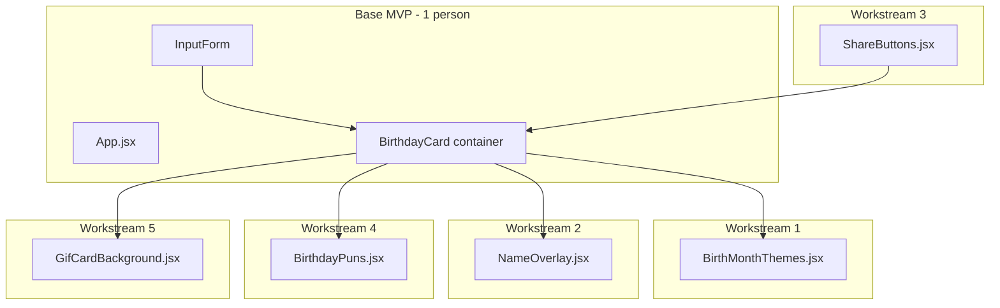

# Birthday GIF Generator: 5 Parallel Workstreams

## Architecture Overview

A single-page React (Vite) app with a **stub-first scaffold**. One person builds the base MVP with **5 pre-created component files** (each as a minimal stub). The other 4 people each implement one component in parallel. Because each person only touches their own file, merge conflicts are minimized.

---

## Workshop Constraints

- **Frontend-only**: React + Vite, no backend, no external APIs, no database
- **GIF strategy**: Use bundled GIF files in `/public` (e.g., from [Pixabay](https://pixabay.com/gifs/search/birthday/) or similar free sources). No GIPHY/API calls.
- **Share output**: Capture the card with `html2canvas` (or `dom-to-image`), then Download PNG + Copy to clipboard
- **Base MVP**: ~10 minutes, minimal. All 5 feature components start as stubs so teammates never edit `App.jsx`

---

## Base MVP (1 person, Phase 2)

Scaffold a Vite + React app in [`teams/team_6/base_mvp/`](base_mvp/) with:

- **Input form**: Name (text) and Birthday (date picker)
- **BirthdayCard** container: A `div` with `ref={cardRef}` that will hold all child components
- **5 stub components** (each returns a placeholder `div` or `null`):
  1. `BirthMonthThemes.jsx` — returns `null` or a minimal div
  2. `NameOverlay.jsx` — returns `null` or "Happy Birthday!"
  3. `ShareButtons.jsx` — returns `null` or disabled buttons
  4. `BirthdayPuns.jsx` — returns `null` or static text
  5. `GifCardBackground.jsx` — returns `null` or a solid color div
- **1–2 sample GIFs** in `public/gifs/` (e.g., `birthday-cake.gif`, `confetti.gif`) as placeholders
- Wire all stubs into `App.jsx` so the layout is ready; teammates only replace stub implementations

**Critical**: The base MVP author adds all imports and component placements to `App.jsx` up front. Teammates never need to edit `App.jsx`.

---

## Workstream 1: Birth Month Theme Picker

**File**: `src/components/BirthMonthThemes.jsx` (edit stub only)

**Deliverable**: A theme picker that selects accent colors and "vibe" based on birth month. Export a theme object (e.g., `{ primaryColor, secondaryColor }`) or use CSS variables. Optional: small UI to switch themes manually.

**Props**: `birthday` (Date), optional `onThemeChange` callback

**Data**: Hardcoded `BIRTH_MONTH_THEMES` mapping (e.g., January = icy blue, July = sunny yellow)

**No overlap**: Does not touch GIFs or share logic. Only provides theme/color info.

---

## Workstream 2: Name Overlay

**File**: `src/components/NameOverlay.jsx` (edit stub only)

**Deliverable**: Renders "Happy Birthday, [Name]!" and the formatted birth date (e.g., "Born on March 15") with clean typography. Styled to work on top of the GIF background (semi-transparent backdrop or shadow for readability).

**Props**: `name` (string), `birthday` (Date)

**Implementation**: Pure presentational component. No shared state beyond props.

---

## Workstream 3: Copy and Share Buttons

**File**: `src/components/ShareButtons.jsx` (edit stub only)

**Deliverable**: "Download PNG" and "Copy to clipboard" buttons. Uses `html2canvas` to capture the card `div` (via `ref`), then:
- Download: create blob, trigger download
- Copy: `navigator.clipboard.write()` with image blob (fallback: show "Right-click to save" if clipboard fails)

**Props**: `cardRef` (ref to the BirthdayCard container)

**Dependency**: Add `html2canvas` to `package.json` (base MVP can add it; Workstream 3 implements the logic)

**No overlap**: Does not depend on theme, GIF choice, or message content. Just captures whatever is in the card.

---

## Workstream 4: Clever Birthday Puns / Messages

**File**: `src/components/BirthdayPuns.jsx` (edit stub only)

**Deliverable**: Returns a cute, clever message based on birthday. Use hardcoded data:
- **Zodiac-based** (e.g., "You're out of this world, [Name]!" for Aquarius)
- **Month-based** (e.g., "You're the cherry on top!" for June)
- Or a mix

Store mappings in a `BIRTHDAY_MESSAGES` object or array in the same file. Render the selected message with fun styling.

**Props**: `birthday` (Date), optional `name` (string) for personalization

**No overlap**: Purely additive. Does not control layout or GIF choice.

---

## Workstream 5: GIF Library and Card Background

**File**: `src/components/GifCardBackground.jsx` (edit stub only)

**Deliverable**:
- Curated set of 5–8 cute birthday GIFs in `public/gifs/` (royalty-free sources)
- Picks a GIF based on birth month (or random from pool) — e.g., `birth-month % numGifs` for deterministic selection
- Renders the GIF as a full-bleed background for the card (with overlay-friendly opacity if needed)

**Props**: `birthday` (Date), optional `theme` (from Workstream 1) for consistency

**Data**: `GIF_BY_MONTH` or similar mapping in the component or `src/data/gifThemes.js`

**No overlap**: Only provides the background layer. Does not handle text, sharing, or theme colors.

---

## File Ownership Summary

| Person | Primary File | Possible Touches |
|--------|--------------|------------------|
| 1 | `BirthMonthThemes.jsx` | None others |
| 2 | `NameOverlay.jsx` | None others |
| 3 | `ShareButtons.jsx` | `package.json` (add html2canvas if not in MVP) |
| 4 | `BirthdayPuns.jsx` | None others |
| 5 | `GifCardBackground.jsx` | `public/gifs/*` (new assets) |

**App.jsx**: Modified only by the base MVP author. Teammates do not need to change it.

---

## Recommended PR Merge Order

To reduce integration risk, merge in this order:

1. **GifCardBackground** (establishes visual baseline)
2. **NameOverlay** (core content)
3. **BirthdayPuns** (adds clever copy)
4. **BirthMonthThemes** (adds theming)
5. **ShareButtons** (enables share flow; depends on stable card layout)

---

## Related Documents

- [prd.md](prd.md) — Product Requirements Document (high-level summary)
- [base_mvp/](base_mvp/) — Project code
